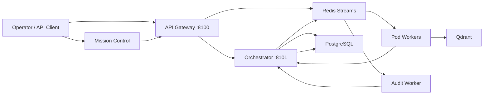
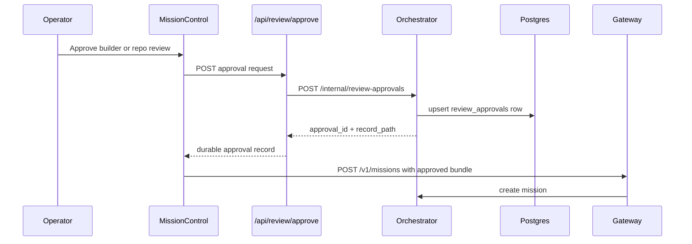
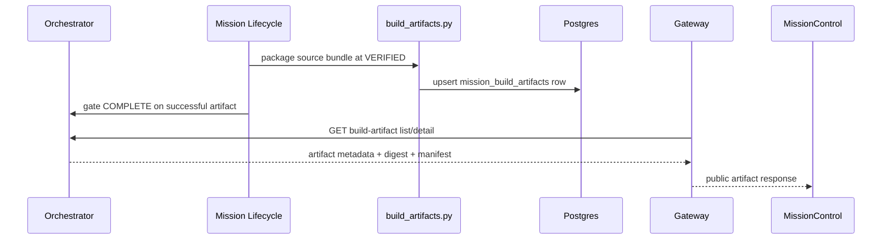
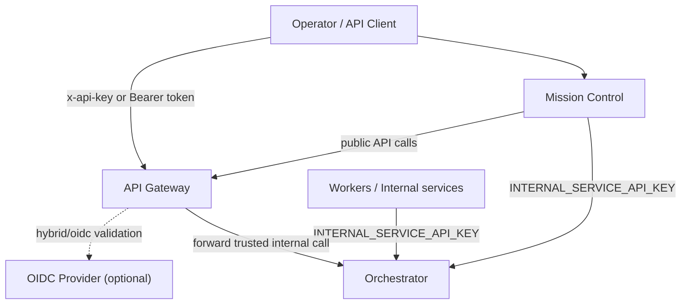
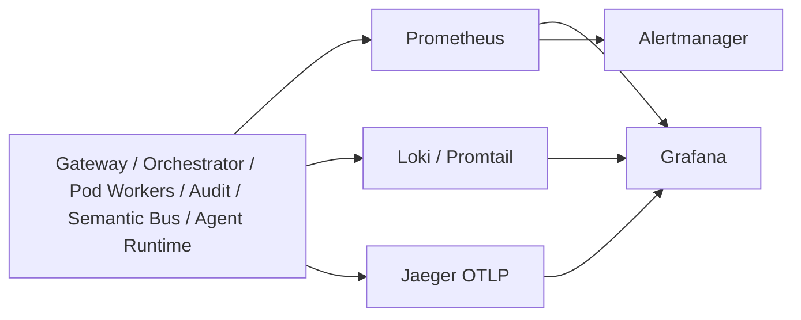

# Architecture Data Flows

Document version: 2026.03.29  
Last updated: 2026-03-29  
Status: Canonical  
Audience: Operators, developers, maintainers, and auditors

This document captures the critical application, identity, and data flows for theFactory. It complements [ARCHITECTURE.md](ARCHITECTURE.md) and [ARCHITECTURE_DIAGRAMS.md](ARCHITECTURE_DIAGRAMS.md) by focusing on runtime movement of requests, credentials, artifacts, telemetry, and persistent state.

## Flow Catalog

- Mission intake and lifecycle flow
- Review approval and launch flow
- Build artifact packaging and retrieval flow
- Identity and access flow
- Observability and telemetry flow

## Mission Intake and Lifecycle Flow

Key properties:

- The gateway owns public intake concerns such as auth, idempotency, rate limiting, and correlation IDs.
- The orchestrator owns mission state, agent routing, approval persistence, build-artifact persistence, and internal operations views.
- Redis Streams connect the orchestrator, pod workers, semantic bus, audit worker, and optional dedicated runtime containers.

## Review Approval and Mission Launch Flow

Key properties:

- Review approvals are durable runtime records, not local filesystem receipts.
- Mission Control depends on `ORCHESTRATOR_INTERNAL_BASE_URL` and `INTERNAL_SERVICE_API_KEY` for the approval persistence step.
- Approved builder/repo bundles become part of mission metadata and drive later artifact packaging.

## Build Artifact Packaging and Retrieval Flow

Key properties:

- Source-bundle missions package a durable `source_bundle_package` artifact at `VERIFIED`.
- Completion for source-bundle missions requires both lifecycle success and a successful stored build artifact.
- Mission Control surfaces artifact status, digest, manifest, storage backend, and size.

## Identity and Access Flow

Key properties:

- Public mutations terminate at the gateway and are controlled by `AUTH_MODE`.
- Internal worker and Mission Control approval-persistence flows use `INTERNAL_SERVICE_API_KEY`.
- The gateway and orchestrator both accept `x-request-id` or `x-correlation-id` and echo `X-Correlation-Id`.

## Observability and Telemetry Flow

Key properties:

- Metrics, logs, and traces are emitted across the control and execution planes.
- Correlation IDs provide a request-level bridge from gateway/operator actions into downstream traces and logs.
- Qualification and release evidence are stored under `docs/evidence/` rather than implied by prose-only documentation.
