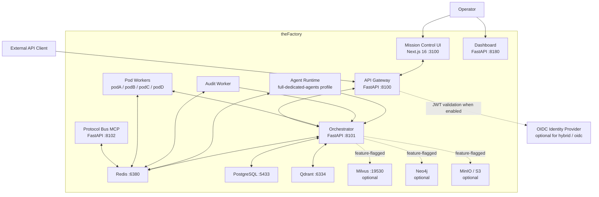
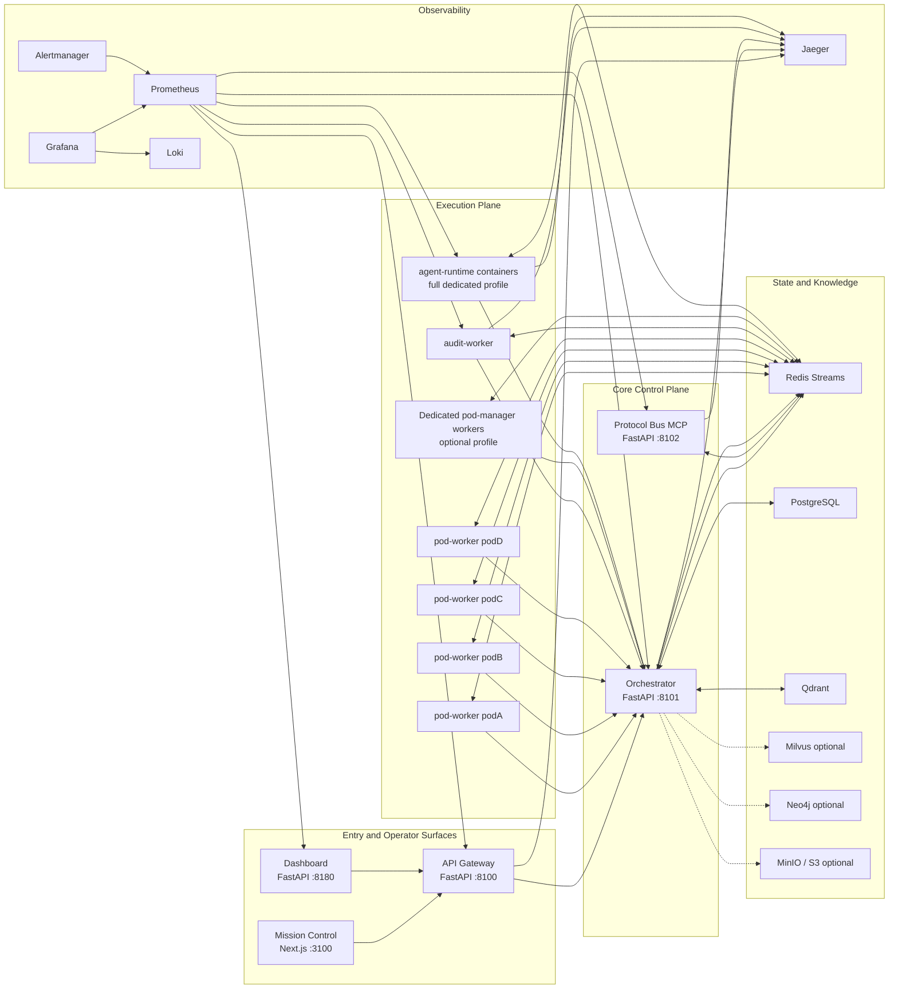
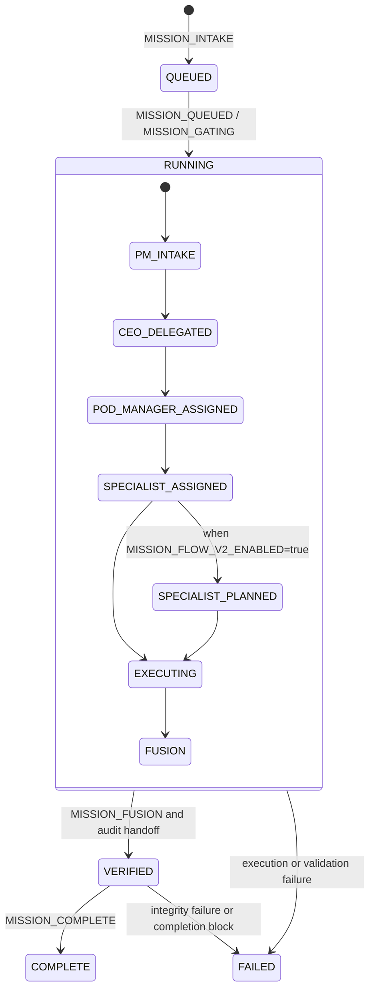
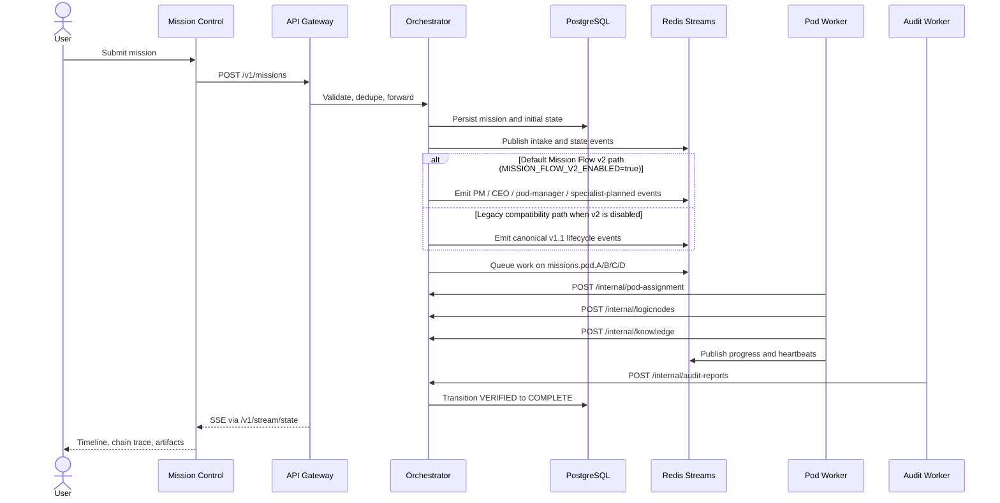
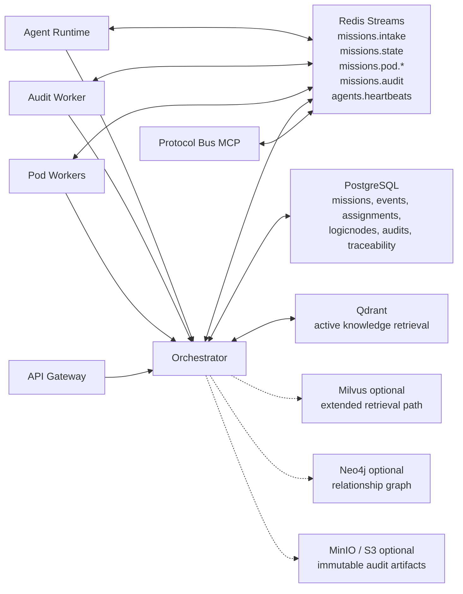
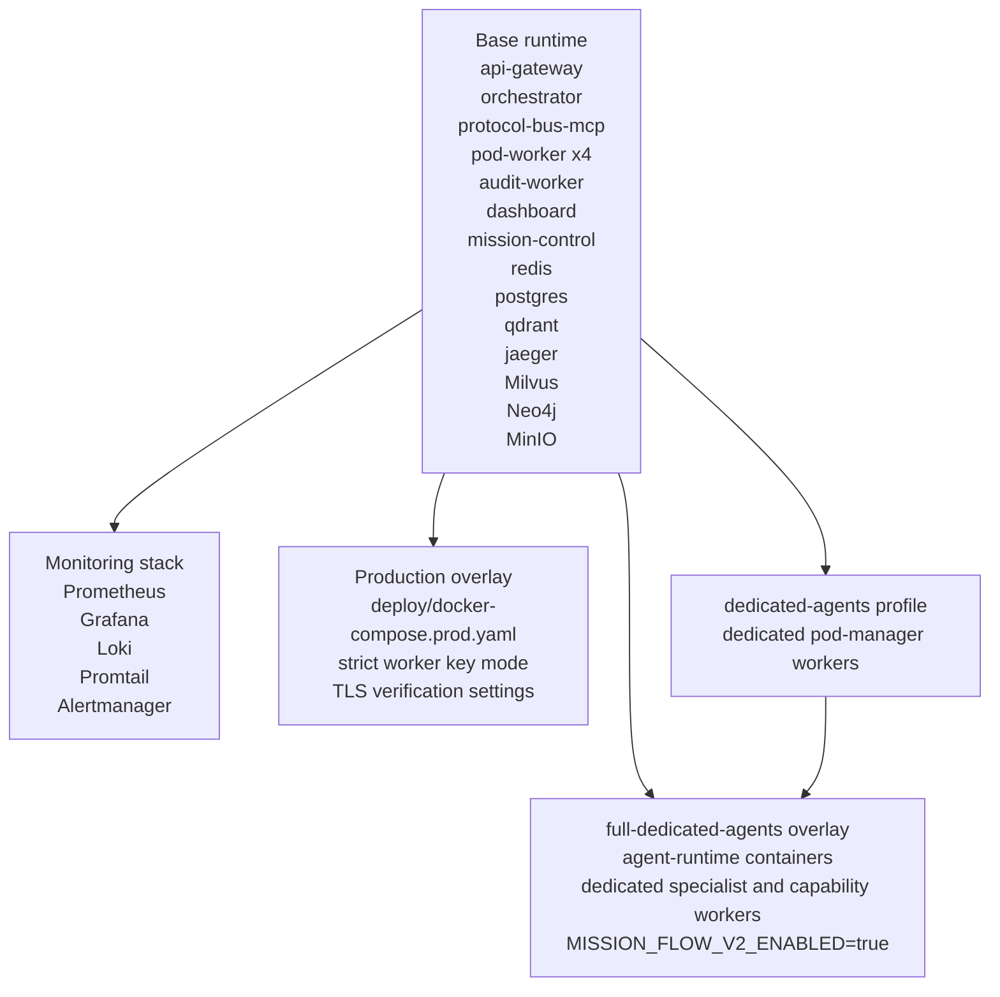
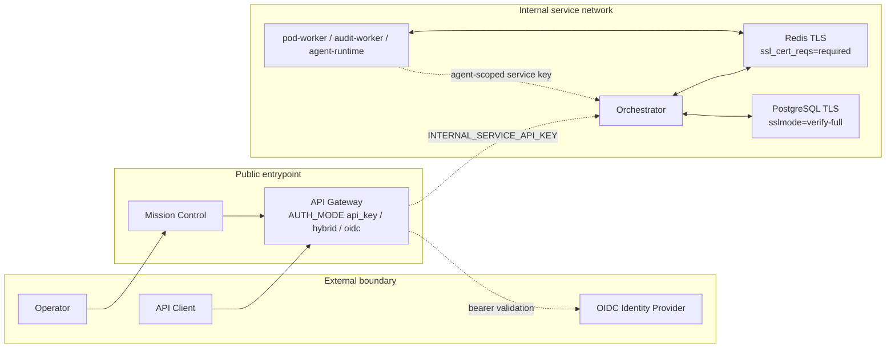

# Architecture Diagrams

Document version: 2026.06.26
Last updated: 2026-06-26
Status: Canonical  
Audience: Operators, developers, maintainers, and auditors

This document contains the canonical diagrams for theFactory. It follows the diagram set defined in
[`DIAGRAM_STANDARDS.md`](DIAGRAM_STANDARDS.md) and is intended to stay aligned with the runtime,
compose profiles, and agent registry in the codebase.

For the detailed runtime, identity, approval, artifact, and telemetry flows, see
[`ARCHITECTURE_DATA_FLOWS.md`](ARCHITECTURE_DATA_FLOWS.md).

## Diagram Catalog

| Diagram | Purpose |
|---------|---------|
| System context view | Shows external actors, entrypoints, and major dependencies |
| Container view | Shows the main runtime services and relationships inside the platform |
| Mission lifecycle state view | Shows canonical mission-state progression and the optional v2 path |
| Mission runtime sequence | Shows the end-to-end mission execution path |
| Multi-agent topology view | Shows the 41-agent hierarchy and delegation structure |
| Data and knowledge plane view | Shows streams, persistence, vector stores, graph store, and artifacts |
| Deployment profile view | Shows the base stack and overlay-based runtime modes |
| Security and trust-boundary view | Shows auth boundaries, service keys, and TLS-protected internal paths |

## System Context View

## Container View

## Mission Lifecycle State View

## Mission Runtime Sequence

## Multi-Agent Topology View

```mermaid
flowchart TB
    PM["AGENT-01-PM\nMission intake and normalization"]
    CEO["AGENT-02-CEO\nCross-pod orchestration"]
    SupportHub["Support Ring\nAGENT-03 through AGENT-11"]

    subgraph Support["Support Ring (9)"]
        Broker["03 Broker"]
        Accountant["04 Accountant"]
        Security["05 Security"]
        IS["06 IS"]
        VC["07 VC"]
        Compliance["08 Compliance"]
        HW["09 HW"]
        Tester["10 Tester"]
        Deploy["11 Deploy"]
    end

    subgraph PodA["Pod A Dynamic (6)"]
        A12["12 PodA Manager"]
        A13["13 PodA Audit"]
        A14["14 Python"]
        A15["15 JavaScript"]
        A16["16 Ruby"]
        A17["17 PHP"]
    end

    subgraph PodB["Pod B Systems (7)"]
        B18["18 PodB Manager"]
        B19["19 PodB Audit"]
        B20["20 C"]
        B21["21 C++"]
        B22["22 Rust"]
        B23["23 Zig"]
        B36["AGENT-36-GO\nGo"]
    end

    subgraph PodC["Pod C Enterprise (6)"]
        C24["24 PodC Manager"]
        C25["25 PodC Audit"]
        C26["26 Java"]
        C27["27 C#"]
        C28["28 Scala"]
        C29["29 Kotlin"]
    end

    subgraph PodD["Pod D Mathematical (8)"]
        D30["30 PodD Manager"]
        D31["31 PodD Audit"]
        D32["32 MATLAB"]
        D33["33 R"]
        D34["34 Julia"]
        D35["35 Mathematica"]
        D37["AGENT-37-HASKELL\nHaskell"]
        D38["AGENT-38-OCAML\nOCaml"]
    end

    subgraph Quality["Support Capability Expansion (3)"]
        Q39["AGENT-39-DEPABS"]
        Q40["AGENT-40-TESTDATA"]
        Q41["AGENT-41-RQCA"]
    end

    PM --> CEO
    Broker --> SupportHub
    Accountant --> SupportHub
    Security --> SupportHub
    IS --> SupportHub
    VC --> SupportHub
    Compliance --> SupportHub
    HW --> SupportHub
    Tester --> SupportHub
    Deploy --> SupportHub
    SupportHub -. advisory, policy, audit, delivery .-> CEO

    CEO --> A12
    CEO --> B18
    CEO --> C24
    CEO --> D30

    A12 --> A13
    A12 --> A14
    A12 --> A15
    A12 --> A16
    A12 --> A17

    B18 --> B19
    B18 --> B20
    B18 --> B21
    B18 --> B22
    B18 --> B23
    B18 --> B36

    C24 --> C25
    C24 --> C26
    C24 --> C27
    C24 --> C28
    C24 --> C29

    D30 --> D31
    D30 --> D32
    D30 --> D33
    D30 --> D34
    D30 --> D35
    D30 --> D37
    D30 --> D38

    CEO -. support work .-> Q39
    CEO -. test data .-> Q40
    CEO -. runtime QC .-> Q41
```

## Data and Knowledge Plane View

## Deployment Profile View

## Security and Trust-Boundary View

## Maintenance Notes

- Keep these diagrams aligned with `deploy/docker-compose*.yaml`, `services/orchestrator`, and the
  canonical docs in `README.md`, `ARCHITECTURE.md`, `OPERATIONS_RUNBOOK.md`, and `IMPLEMENTATION_STATUS.md`.
- Treat `MISSION_FLOW_V2_ENABLED=true` as the default runtime baseline unless the
  runtime defaults change in code.
- Update the multi-agent topology view whenever `services/orchestrator/orchestrator/agent_registry.py`
  changes.

