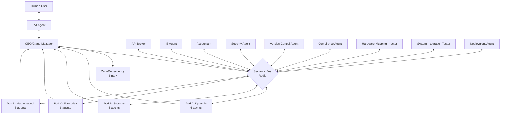

# SYSTEM ARCHITECTURE DOCUMENT (SAD)

Document version: 2026.03.29
Last updated: 2026-03-29
Status: Archived Legacy
## Holy Grail Refinery: Technical Architecture Specification

**Version:** 1.0  
**Date:** February 2026  
**Status:** Design Phase  
**Document Owner:** Chief System Architect

---

## EXECUTIVE SUMMARY

The Holy Grail Refinery is a distributed AI system running on local hardware that extracts computational intent from code written in 14 programming languages, refines it into a universal intermediate representation (Refined-IR), and synthesizes optimized, zero-dependency binaries. This document specifies the complete system architecture including the 35-agent organization, communication infrastructure, data management, and security model.

### Key Architectural Principles

1. **Context Isolation:** Each agent operates in a physically isolated context with its own API key and 1M-token window
2. **Event-Driven Coordination:** Agents communicate asynchronously via a Redis-based Semantic Bus
3. **Quality Gating:** Formal verification at pod level prevents error propagation
4. **Local Execution:** All processing occurs on local Docker containers; only API calls are external
5. **Stateless Agents, Stateful Infrastructure:** Agents are ephemeral; state persists in shared databases

---

## 1. HIGH-LEVEL SYSTEM ARCHITECTURE OVERVIEW

### 1.1 The 14 → 4 → 1 Comprehension Model

The system architecture reflects a hierarchical refinement process:

```
14 Programming Languages (Input Layer)
    ↓ [Specialist Agents Extract]
4 Language Paradigm Pods (Refinement Layer)
    ↓ [Sub-Managers Consolidate]
1 Unified Logic Stream (Fusion Layer)
    ↓ [CEO Agent Synthesizes]
Optimized Binary Output (Delivery Layer)
```

### 1.2 Architectural Layers

#### **Layer 1: User Interface (1 Agent)**
- **PM Agent:** Single point of contact with human users
- Captures "vibes" and translates to Feature Contracts
- Performs visual verification on outputs

#### **Layer 2: Executive Tier (1 Agent)**
- **CEO/Grand Manager:** Orchestrates all pods and support agents
- Performs cross-pod logic fusion
- Owns the Global State Graph

#### **Layer 3: Support Ring (9 Agents)**
Specialized agents providing system-wide services:
- **API Broker:** Token traffic control and cost optimization
- **Accountant:** Budget enforcement and FinOps
- **Security Agent:** Vulnerability scanning and threat modeling
- **IS Agent:** Knowledge indexing and semantic search
- **Version Control Agent:** Git operations and state management
- **Compliance Agent:** License tracking and IP provenance
- **Hardware-Mapping Injector:** Platform-specific optimization
- **System Integration Tester:** End-to-end validation
- **Deployment Agent:** Binary delivery and environment setup

#### **Layer 4: The Refinery Core (24 Agents in 4 Pods)**

Each pod contains 6 agents organized identically:
- **Pod A - Dynamic Languages:** Python, JavaScript, Ruby, PHP
- **Pod B - Systems Languages:** C, C++, Rust, Zig
- **Pod C - Enterprise Languages:** Java, C#, Scala, Kotlin
- **Pod D - Mathematical Languages:** MATLAB, R, Julia, Mathematica

**Pod Structure:**
```
Pod X (6 agents total)
  ├── Sub-Manager (1) - Coordinates pod operations
  ├── QC/Audit Agent (1) - Formal verification gate
  └── Specialists (4) - Language-specific extraction
```

### 1.3 System Topology Diagram



---

## 2. 35-AGENT ORGANIZATION AND TIER STRUCTURE

### 2.1 Agent Distribution by Tier

| Tier | Count | Agents | Primary Function |
|------|-------|--------|-----------------|
| **User Interface** | 1 | PM Agent | Human interaction |
| **Executive** | 1 | CEO/Grand Manager | Orchestration & fusion |
| **Support Ring** | 9 | Broker, Accountant, Security, IS, VC, Compliance, HW, Test, Deploy | System services |
| **Pod Core** | 24 | 4 Sub-Managers, 4 Auditors, 16 Specialists | Language comprehension |
| **Total** | **35** | | |

### 2.2 Agent Communication Matrix

| From/To | PM | CEO | Support | Pods | Bus |
|---------|----|----|---------|------|-----|
| **PM Agent** | - | ✓ | - | - | - |
| **CEO** | ✓ | - | ✓ | via Bus | ✓ |
| **Support Ring** | - | via Bus | via Bus | via Bus | ✓ |
| **Pods** | - | via Bus | via Bus | Internal | ✓ |

**Key Insight:** Only PM ↔ CEO communicate directly. All other communication flows through the Semantic Bus for scalability and decoupling.

### 2.3 Agent Responsibility Mapping

#### **Execution Path (Mission Flow)**

| Phase | Responsible Agents | Output |
|-------|-------------------|--------|
| **Intake** | PM Agent | Feature Contract + Visual Blueprint |
| **Planning** | CEO + IS Agent | Refined-IR Contract + Knowledge Context |
| **Extraction** | 16 Specialist Agents | Raw LogicNodes (language-specific) |
| **Verification** | 4 QC/Audit Agents | Verified LogicNodes (0.0001% tolerance) |
| **Consolidation** | 4 Sub-Manager Agents | Pod-level Group Standards |
| **Fusion** | CEO Agent | Unified Master Logic Stream |
| **Optimization** | Hardware-Mapping Injector | Platform-specific tuning |
| **Compilation** | Systems Pod | Machine code / Binary |
| **Verification (E2E)** | System Integration Tester | Test results |
| **Visual Check** | PM Agent (Vision-AI) | UI/UX validation |
| **Deployment** | Deployment Agent | Delivered binary |

#### **Support Path (Continuous)**

| Function | Responsible Agent | Frequency |
|----------|------------------|-----------|
| **Cost Monitoring** | Accountant | Real-time |
| **API Management** | API Broker | Per-request |
| **Security Scanning** | Security Agent | Per LogicNode |
| **Knowledge Updates** | IS Agent | Continuous indexing |
| **Compliance Checks** | Compliance Agent | Per extraction |
| **Git Operations** | Version Control Agent | Per state change |

---

## 3. DOCKER CONTAINERIZATION STRATEGY ON AW1 HARDWARE

### 3.1 Hardware Foundation (AW1 Specifications)

**Compute:**
- **CPU:** Intel i7-14700F (20 cores: 8 P-cores + 12 E-cores)
- **GPU:** NVIDIA RTX 4060 Ti (16GB VRAM)
- **RAM:** 32GB DDR5
- **Storage:** 1TB NVMe SSD (for Knowledge Lake and databases)

**Operating System:** Ubuntu 24.04 LTS

### 3.2 Container Architecture

#### **Container Distribution**

```
35 Agent Containers
  ├── 1 × PM Agent (1 GB RAM, 0.5 CPU)
  ├── 1 × CEO Agent (2 GB RAM, 1.0 CPU)
  ├── 9 × Support Ring (1 GB RAM each, 0.5 CPU each)
  ├── 4 × Sub-Managers (1.5 GB RAM each, 0.75 CPU each)
  ├── 4 × Audit Agents (2 GB RAM each, 1.0 CPU each - compute-heavy)
  └── 16 × Specialists (1.5 GB RAM each, 0.75 CPU each)

5 Infrastructure Containers
  ├── Redis (Semantic Bus) - 4 GB RAM, 2 CPU
  ├── PostgreSQL (Global State Graph) - 4 GB RAM, 1 CPU
  ├── LlamaIndex + Vector DB (Knowledge Lake) - 8 GB RAM, 2 CPU
  ├── Git Server (Traceability) - 2 GB RAM, 0.5 CPU
  └── Mission Control UI (Next.js) - 2 GB RAM, 1 CPU

Total Resource Allocation:
  RAM: ~28GB (leaving 4GB for OS)
  CPU: ~18 cores (leaving 2 for OS/overhead)
```

#### **Docker Compose Structure**

```yaml
version: '3.8'

services:
  # Layer 1: User Interface
  pm-agent:
    image: refinery/agent-pm:latest
    container_name: refinery-pm-agent
    env_file: .env
    environment:
      - AGENT_TYPE=pm
      - API_KEY=${PM_API_KEY}
      - REDIS_HOST=redis
    resources:
      limits:
        memory: 1G
        cpus: '0.5'
    networks:
      - refinery-net
    depends_on:
      - redis

  # Layer 2: Executive
  ceo-agent:
    image: refinery/agent-ceo:latest
    container_name: refinery-ceo-agent
    env_file: .env
    environment:
      - AGENT_TYPE=ceo
      - API_KEY=${CEO_API_KEY}
      - REDIS_HOST=redis
      - POSTGRES_HOST=postgres
    resources:
      limits:
        memory: 2G
        cpus: '1.0'
    networks:
      - refinery-net
    depends_on:
      - redis
      - postgres

  # Layer 3: Support Ring (9 services, pattern shown for API Broker)
  api-broker:
    image: refinery/agent-support:latest
    container_name: refinery-api-broker
    env_file: .env
    environment:
      - AGENT_TYPE=api_broker
      - API_KEY=${BROKER_API_KEY}
      - REDIS_HOST=redis
    resources:
      limits:
        memory: 1G
        cpus: '0.5'
    networks:
      - refinery-net
    depends_on:
      - redis

  # [Additional 8 support agents follow same pattern]

  # Layer 4: Pods (24 services, pattern shown for Python Specialist)
  specialist-python:
    image: refinery/agent-specialist:latest
    container_name: refinery-specialist-python
    env_file: .env
    environment:
      - AGENT_TYPE=specialist
      - LANGUAGE=python
      - POD=dynamic
      - API_KEY=${SPECIALIST_PYTHON_API_KEY}
      - REDIS_HOST=redis
      - VECTOR_DB_HOST=vector-db
    resources:
      limits:
        memory: 1.5G
        cpus: '0.75'
    networks:
      - refinery-net
    depends_on:
      - redis
      - vector-db

  # [Additional 23 pod agents follow same pattern]

  # Infrastructure: Semantic Bus
  redis:
    image: redis:7-alpine
    container_name: refinery-redis
    command: redis-server --maxmemory 4gb --maxmemory-policy allkeys-lru
    ports:
      - "6379:6379"
    volumes:
      - redis-data:/data
    resources:
      limits:
        memory: 4G
        cpus: '2.0'
    networks:
      - refinery-net

  # Infrastructure: Global State Graph
  postgres:
    image: postgres:16-alpine
    container_name: refinery-postgres
    environment:
      - POSTGRES_DB=refinery_state
      - POSTGRES_USER=refinery
      - POSTGRES_PASSWORD=${POSTGRES_PASSWORD}
    volumes:
      - postgres-data:/var/lib/postgresql/data
    resources:
      limits:
        memory: 4G
        cpus: '1.0'
    networks:
      - refinery-net

  # Infrastructure: Knowledge Lake
  vector-db:
    image: refinery/vector-db:latest
    container_name: refinery-vector-db
    volumes:
      - vector-db-data:/data
      - knowledge-lake:/knowledge
    resources:
      limits:
        memory: 8G
        cpus: '2.0'
    networks:
      - refinery-net

  # Infrastructure: Mission Control UI
  mission-control:
    image: refinery/mission-control:latest
    container_name: refinery-mission-control
    ports:
      - "3000:3000"
    environment:
      - REDIS_HOST=redis
      - POSTGRES_HOST=postgres
    resources:
      limits:
        memory: 2G
        cpus: '1.0'
    networks:
      - refinery-net
    depends_on:
      - redis
      - postgres

networks:
  refinery-net:
    driver: bridge

volumes:
  redis-data:
  postgres-data:
  vector-db-data:
  knowledge-lake:
```

### 3.3 Container Isolation and Security

#### **Network Isolation**

- **refinery-net** bridge network isolates all containers from external network
- Only Mission Control UI exposes external port (3000)
- Inter-container communication restricted to defined dependencies
- Redis and Postgres not exposed to host

####** **Resource Limits**

- Hard memory caps prevent OOM scenarios
- CPU quotas ensure fair scheduling
- All agents capped to prevent resource monopolization

#### **Secret Management**

- API keys stored in encrypted `.env` file (AES-256)
- API Broker manages key rotation
- Keys never logged or transmitted in plain text
- Separate key per agent (35 total)

#### **Container Health Monitoring**

Each container includes:
```yaml
healthcheck:
  test: ["CMD", "python", "healthcheck.py"]
  interval: 30s
  timeout: 10s
  retries: 3
  start_period: 40s
```

Unhealthy containers automatically restarted by Docker.

---

## 4. NETWORK TOPOLOGY AND COMMUNICATION PATTERNS

### 4.1 Communication Infrastructure

#### **The Semantic Bus (Redis)**

**Purpose:** Event-driven message broker for all inter-agent communication

**Architecture:**
- Redis Pub/Sub for broadcast messages
- Redis Streams for persistent message queues
- Redis Hashes for agent state
- Redis Lists for work queues

**Message Channels:**

| Channel | Publisher(s) | Subscriber(s) | Message Type |
|---------|-------------|---------------|--------------|
| `protocol:alpha` | CEO | Sub-Managers, Support | Directives |
| `protocol:beta` | Specialists | Sub-Managers | LogicNodes |
| `protocol:delta` | Audit Agents | Sub-Managers, CEO | Verification Results |
| `protocol:sigma` | IS Agent | All Agents | Knowledge Updates |
| `protocol:omega` | PM Agent | CEO | User Requirements |
| `protocol:rho` | API Broker | All Agents | Traffic Control |
| `pod:dynamic:*` | Pod A Agents | Pod A Agents | Internal coordination |
| `pod:systems:*` | Pod B Agents | Pod B Agents | Internal coordination |
| `pod:enterprise:*` | Pod C Agents | Pod C Agents | Internal coordination |
| `pod:mathematical:*` | Pod D Agents | Pod D Agents | Internal coordination |

**Message Format (Standard):**

```json
{
  "protocol": "alpha|beta|delta|sigma|omega|rho",
  "message_id": "uuid",
  "timestamp": "ISO8601",
  "sender": "agent_id",
  "recipients": ["agent_id"] or "broadcast",
  "payload": {
    // Protocol-specific content
  },
  "priority": "low|normal|high|critical",
  "ttl": 3600
}
```

### 4.2 Communication Patterns

#### **Pattern 1: Command Flow (Protocol Alpha)**

```
CEO Agent → Semantic Bus (channel: protocol:alpha) → Sub-Managers
```

Used for: Mission assignments, phase transitions, resource allocation

#### **Pattern 2: Production Flow (Protocol Beta)**

```
Specialist → Semantic Bus (channel: protocol:beta) → QC/Audit Agent → Sub-Manager
```

Used for: LogicNode submission and verification

#### **Pattern 3: Knowledge Broadcast (Protocol Sigma)**

```
IS Agent → Semantic Bus (channel: protocol:sigma) → All Subscribers
```

Used for: Documentation updates, best practices, security alerts

#### **Pattern 4: Quality Gate (Protocol Delta)**

```
Audit Agent → Semantic Bus (channel: protocol:delta) → Sub-Manager + CEO
```

Used for: Verification pass/fail notifications

#### **Pattern 5: Traffic Control (Protocol Rho)**

```
API Broker → Semantic Bus (channel: protocol:rho) → All Agents
```

Used for: Rate limiting, model routing, cost alerts

### 4.3 Data Flow Architecture

```
User Input
    ↓
PM Agent (Feature Contract)
    ↓
CEO Agent (Refined-IR Contract)
    ↓
Semantic Bus (Broadcast to Pods)
    ↓
[Pod A]  [Pod B]  [Pod C]  [Pod D] (Parallel Extraction)
    ↓       ↓       ↓       ↓
Specialists → LogicNodes → Semantic Bus
    ↓
Audit Agents (Verification: 1,000 tests @ 0.0001% tolerance)
    ↓
Sub-Managers (Consolidation)
    ↓
Semantic Bus (4 Group Standards)
    ↓
CEO Agent (Cross-Pod Fusion)
    ↓
Hardware-Mapping Injector (Optimization)
    ↓
Systems Pod (Binary Compilation)
    ↓
Deployment Agent (Delivery)
    ↓
PM Agent (Visual Verification)
    ↓
User Output (Zero-Dependency Binary)
```

---

## 5. SCALABILITY AND PERFORMANCE CONSIDERATIONS

### 5.1 Horizontal Scalability

**Current State (Local AW1):**
- 35 containers on single machine
- Constrained by 32GB RAM, 20 CPU cores

**Future Cloud Deployment:**
- Each agent becomes independent service
- Semantic Bus becomes distributed (Redis Cluster or Kafka)
- Global State Graph becomes distributed (CockroachDB or PostgreSQL HA)
- Knowledge Lake becomes shared storage (S3 + distributed vector DB)

**Scaling Strategy:**

| Component | Local (Phase 1-3) | Cloud (Phase 4+) |
|-----------|-------------------|------------------|
| **Agents** | Docker containers on 1 host | Kubernetes pods across nodes |
| **Semantic Bus** | Single Redis instance | Redis Cluster (6+ nodes) |
| **State Graph** | Single Postgres instance | Postgres HA (primary + replicas) |
| **Knowledge Lake** | Local SSD | Distributed object storage + vector DB cluster |
| **Mission Control** | Single Next.js container | Load-balanced replicas |

### 5.2 Performance Optimization

#### **Context Caching Strategy**

**Goal:** Reduce API costs by 90% through aggressive context caching

**Implementation:**
```
Specialist Agent Context Window (1M tokens):
  ├── Cached: Language documentation (700K tokens) [Never expires]
  ├── Cached: Domain concept catalog (100K tokens) [Expires monthly]
  ├── Dynamic: Mission-specific code (200K tokens) [Per-mission]
  └── Reserved: Conversation history (up to 200K tokens)
```

**Cache Hit Rate Target:** 90%+

**Cost Calculation:**
- Without caching: 35 agents × 1M tokens × $0.01/1K = $350/mission
- With 90% caching: 35 agents × 100K tokens × $0.01/1K = $35/mission
- **Savings: $315/mission (90%)**

#### **Parallel Execution**

All 16 Specialists run simultaneously:
- No waiting for sequential extraction
- Pod-level parallelism (4 pods)
- Specialist-level parallelism (4 specialists per pod)

**Theoretical Speedup:**
- Sequential: 16 specialists × 5 min/each = 80 minutes
- Parallel: max(5 min across all specialists) = 5 minutes
- **16x speedup**

Actual speedup accounts for:
- API rate limits (handled by API Broker)
- Resource contention (mitigated by container limits)
- Verification overhead (run in parallel)

**Expected Real-World Speedup:** 10-12x

#### **Verification Optimization**

**Challenge:** 1,000 test simulations per LogicNode could be slow

**Optimization Strategies:**
1. **Test Caching:** Cache verification results for identical LogicNodes
2. **Incremental Testing:** Run fast tests first, only proceed to expensive tests if fast tests pass
3. **Parallel Testing:** Run 1,000 tests across multiple threads
4. **GPU Acceleration:** Use RTX 4060 Ti for numerical stability tests (Math Pod)

**Target:** < 30 seconds average verification time per LogicNode

### 5.3 Bottleneck Analysis

| Potential Bottleneck | Mitigation Strategy |
|---------------------|---------------------|
| **API Rate Limits** | API Broker queues requests, routes to Flash model for simple operations |
| **Redis Throughput** | Use Redis pipelining, consider Redis Cluster for scaling |
| **Postgres Writes** | Batch state updates, use connection pooling |
| **Vector DB Queries** | Index optimization, query result caching, semantic query preprocessing |
| **Disk I/O** | NVMe SSD, async I/O, aggressive caching |
| **Memory Pressure** | Container limits enforce discipline, swap disabled |

---

## 6. SECURITY ARCHITECTURE AND THREAT MODEL

### 6.1 Security Objectives

1. **Confidentiality:** User code and missions never leave local infrastructure (except API calls)
2. **Integrity:** LogicNodes cannot be tampered with between agents
3. **Availability:** System remains operational even if individual agents fail
4. **Auditability:** Complete traceability of every LogicNode from source to binary

### 6.2 Threat Model

#### **Threat 1: Malicious User Input**

**Attack Vector:** User submits malicious code designed to exploit extraction process

**Impact:** High - Could compromise agent, extract API keys, or poison Knowledge Lake

**Mitigations:**
- All user input processed in isolated containers
- Specialists extract to LogicNodes, never execute user code directly
- Audit Agents verify against original behavior, would detect malicious mutations
- Compliance Agent checks for known malware signatures

#### **Threat 2: Agent Prompt Injection**

**Attack Vector:** Attacker crafts code comments or strings designed to manipulate agent behavior

**Impact:** Medium - Agent might extract incorrect LogicNodes or skip verification

**Mitigations:**
- 7-part role definitions create strong agent personas resistant to manipulation
- Audit Agent verification catches incorrect extractions (1,000 tests)
- LangGraph state machine enforces strict workflow, agents can't skip steps
- Security Agent scans for injection patterns

#### **Threat 3: API Key Compromise**

**Attack Vector:** Attacker gains access to one of the 35 API keys

**Impact:** High - Cost exposure, potential data exfiltration via API

**Mitigations:**
- API keys encrypted at rest (AES-256)
- API Broker enforces rate limits per key
- Accountant monitors for anomalous token usage
- Key rotation capability (can invalidate and replace compromised key)
- Keys stored in encrypted vault, only API Broker has decrypt capability

#### **Threat 4: Container Escape**

**Attack Vector:** Attacker exploits Docker vulnerability to break out of container

**Impact:** Critical - Could compromise entire host system

**Mitigations:**
- Docker containers run as non-root users
- Seccomp and AppArmor profiles restrict syscalls
- Container networking isolated from host
- Regular Docker updates
- Host OS hardening (Ubuntu 24.04 LTS with security patches)

#### **Threat 5: Semantic Bus Interception**

**Attack Vector:** Attacker intercepts Redis messages to read or modify LogicNodes

**Impact:** High - Could steal intellectual property or inject malicious logic

**Mitigations:**
- Redis runs inside isolated Docker network, not exposed to host
- TLS encryption for Redis connections (in production)
- Message signing using agent-specific keys (LogicNodes include creator signature)
- Audit trail in Traceability Ledger detects modifications

#### **Threat 6: Supply Chain Attack**

**Attack Vector:** Compromised language documentation or library in Knowledge Lake

**Impact:** High - Specialists could extract incorrect or malicious logic

**Mitigations:**
- IS Agent verifies checksums of indexed documentation
- Compliance Agent tracks provenance of all extracted LogicNodes
- Audit Agent verification detects behavioral changes
- Knowledge Lake content versioned, can rollback to known-good state

### 6.3 Security Monitoring

**Security Agent Responsibilities:**
- Continuous vulnerability scanning of LogicNodes
- Pattern matching for known exploits
- Static analysis for suspicious behavior (e.g., network calls in pure functions)
- Threat intelligence integration (CVE feeds)

**Security Dashboards (Mission Control):**
- Agent health status
- API key usage anomalies
- Verification failure rates (spikes could indicate attacks)
- Resource usage anomalies
- Failed authentication attempts

**Incident Response:**
1. **Detection:** Security Agent or monitoring detects anomaly
2. **Isolation:** Affected agent container stopped immediately
3. **Analysis:** Logs exported for forensic analysis
4. **Remediation:** Container rebuilt from clean image
5. **Recovery:** State restored from last known-good checkpoint

### 6.4 Compliance and Audit

**Traceability Ledger (SQLite):**

Every LogicNode includes:
```json
{
  "logicnode_id": "uuid",
  "source_library": "numpy==1.26.0",
  "source_function": "numpy.filter",
  "extracted_by": "specialist_python",
  "extraction_timestamp": "ISO8601",
  "verified_by": "audit_poda",
  "verification_timestamp": "ISO8601",
  "tests_passed": 1000,
  "tests_total": 1000,
  "included_in_fusion": true,
  "fusion_timestamp": "ISO8601",
  "fused_by": "ceo_agent",
  "output_binary_hash": "sha256:..."
}
```

**Audit Capabilities:**
- Trace any piece of binary back to source library and agent responsible
- Verify chain of custody for compliance (license requirements)
- Detect if malicious logic was introduced at any stage
- Recreate entire mission from logs (reproducible builds)

---

## 7. FAILURE MODES AND RECOVERY

### 7.1 Agent Failure Scenarios

| Failure Mode | Detection | Recovery | Impact |
|-------------|-----------|----------|--------|
| **Agent Crash** | Health check timeout | Auto-restart container | Mission delayed ~30s |
| **Agent Hallucination** | Audit Agent catches | Re-extraction by specialist | Mission delayed ~5 min |
| **API Rate Limit** | API Broker detects | Queue request, retry | Mission delayed ~1-2 min |
| **Out of Memory** | Container OOM kill | Restart with increased limit | Mission delayed ~1 min |
| **Verification Timeout** | Audit Agent timeout | Reduce test count or abort | Mission fails or continues with warning |

### 7.2 Infrastructure Failure Scenarios

| Failure Mode | Detection | Recovery | Impact |
|-------------|-----------|----------|--------|
| **Redis Crash** | Connection failure | Restart from persistent data | All agents pause ~30s |
| **Postgres Crash** | Connection failure | Restart from WAL | State graph temporarily unavailable |
| **Vector DB Crash** | Query failure | Restart, reindex if needed | Specialists use cached docs |
| **Disk Full** | Monitoring alert | Admin intervention required | System halts |
| **Network Partition** | API Broker detects | Wait for resolution | External APIs unavailable |

### 7.3 State Recovery

**LangGraph State Persistence:**

Mission state saved to Postgres every 30 seconds:
```json
{
  "mission_id": "uuid",
  "current_phase": "extraction|verification|fusion|deployment",
  "completed_logicnodes": ["uuid", "uuid", ...],
  "pending_logicnodes": ["uuid", ...],
  "failed_logicnodes": ["uuid", ...],
  "agent_assignments": {
    "specialist_python": ["task_uuid", ...],
    ...
  }
}
```

**Recovery Process:**
1. System detects crash (agent or infrastructure)
2. LangGraph loads last saved state from Postgres
3. Agents query their assigned tasks
4. Incomplete tasks re-queued
5. Completed LogicNodes not re-extracted
6. Mission resumes from last checkpoint

**RTO (Recovery Time Objective):** < 2 minutes  
**RPO (Recovery Point Objective):** < 30 seconds (maximum work lost)

---

## 8. FUTURE ARCHITECTURE EVOLUTION

### 8.1 Cloud Deployment Model (Phase 4)

**Transition from Local to Cloud:**

| Component | Local (AW1) | Cloud (Kubernetes) |
|-----------|-------------|-------------------|
| **Agents** | Docker Compose | Kubernetes Deployments |
| **Semantic Bus** | Single Redis | Redis Sentinel + Cluster |
| **State Graph** | Single Postgres | PostgreSQL HA (Patroni) |
| **Knowledge Lake** | Local SSD | S3 + Distributed Vector DB |
| **Scaling** | Manual (restart compose) | Auto-scaling (HPA) |
| **Networking** | Bridge network | Service mesh (Istio) |
| **Secrets** | Local .env file | Kubernetes Secrets + Vault |
| **Monitoring** | Docker logs + Mission Control | Prometheus + Grafana |

### 8.2 Multi-Tenancy Architecture

**Isolation Strategy:**
- Each customer gets dedicated agent pool (35 containers)
- Shared Knowledge Lake with tenant-specific views
- Separate Redis channels per tenant
- Postgres schema per tenant
- API rate limits per tenant

**Resource Allocation:**
- Small tenants: 1 agent pool (35 containers)
- Large tenants: Multiple agent pools for parallelism
- Elastic scaling based on mission queue depth

### 8.3 Geographic Distribution

**Requirements for Global Deployment:**
- Low-latency access for users worldwide
- Data sovereignty compliance (GDPR, etc.)
- Disaster recovery across regions

**Architecture:**
- Primary region: Full deployment (agents + infrastructure)
- Secondary regions: Read replicas of Knowledge Lake
- Active-active setup for Mission Control UI
- Cross-region replication for critical data

---

## APPENDIX A: CONTAINER IMAGE SPECIFICATIONS

### Base Images

**Agent Base Image:**
```dockerfile
FROM python:3.11-slim
RUN apt-get update && apt-get install -y \
    gcc g++ make \
    && rm -rf /var/lib/apt/lists/*
COPY requirements.txt /app/
RUN pip install --no-cache-dir -r /app/requirements.txt
COPY agent_framework/ /app/agent_framework/
WORKDIR /app
HEALTHCHECK --interval=30s --timeout=10s --retries=3 \
  CMD python healthcheck.py
USER agentuser
ENTRYPOINT ["python", "agent_framework/main.py"]
```

**Infrastructure Images:**
- Redis: Official `redis:7-alpine`
- Postgres: Official `postgres:16-alpine`
- Vector DB: Custom image based on `milvus:latest` or `weaviate:latest`

---

## APPENDIX B: NETWORK PORTS

| Service | Port | Exposed to Host? | Purpose |
|---------|------|-----------------|---------|
| Redis | 6379 | No | Semantic Bus (internal only) |
| Postgres | 5432 | No | State Graph (internal only) |
| Vector DB | 19530 | No | Knowledge Lake queries (internal only) |
| Mission Control UI | 3000 | **Yes** | User interface |

---

## APPENDIX C: RESOURCE MONITORING

**Key Metrics:**

| Metric | Target | Alert Threshold |
|--------|--------|-----------------|
| **Total Memory Usage** | < 28GB | > 30GB |
| **Total CPU Usage** | < 18 cores | > 19 cores |
| **Redis Memory** | < 3.5GB | > 3.8GB |
| **Postgres Connections** | < 50 | > 80 |
| **Disk Usage** | < 800GB | > 900GB |
| **API Cost/Hour** | < $50 | > $100 |

---

**Document End**
