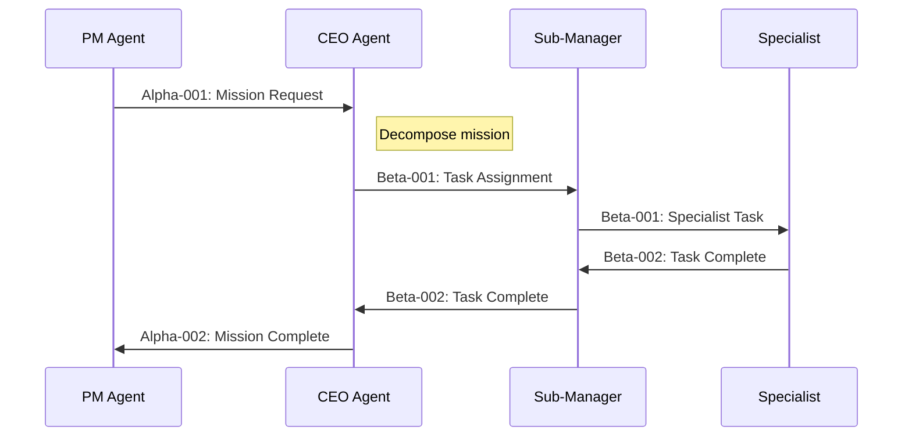

# DOCUMENT 54: PROTOCOL EXTENSION GUIDE
## Holy Grail Refinery - Documentation & Training

**Document ID:** 54  
**Version:** 1.0  
**Created:** February 6, 2026  
**Category:** Documentation & Training  
**Status:** Specification Complete

---

## EXECUTIVE SUMMARY

This document provides comprehensive guidance for **extending the Holy Grail Refinery communication protocols**. It covers how to add new protocols, extend existing ones, maintain backward compatibility, and test protocol implementations.

**Current Protocols:**
- **Alpha:** PM ↔ CEO (Mission management)
- **Beta:** CEO ↔ Sub-Managers (Work distribution)
- **Delta:** Specialists → Audit (Verification)
- **Sigma:** Agents ↔ Knowledge (Documentation queries)
- **Omega:** CEO ↔ Support (Infrastructure)
- **Rho:** UI ↔ PM (User interaction)

**When to Create New Protocols:**
- New agent tier or category
- New integration requirements
- Specialized communication patterns
- Performance optimization needs

---

## TABLE OF CONTENTS

1. [Protocol Design Principles](#1-protocol-design-principles)
2. [Creating New Protocols](#2-creating-new-protocols)
3. [Extending Existing Protocols](#3-extending-existing-protocols)
4. [Message Schema Design](#4-message-schema-design)
5. [Protocol Versioning](#5-protocol-versioning)
6. [Backward Compatibility](#6-backward-compatibility)
7. [Protocol Testing](#7-protocol-testing)
8. [Documentation Requirements](#8-documentation-requirements)
9. [Deployment Strategy](#9-deployment-strategy)
10. [Examples & Templates](#10-examples--templates)

---

## 1. PROTOCOL DESIGN PRINCIPLES

### 1.1 Core Principles

**CLARITY:** Message intent should be immediately obvious
```json
// Good
{"message_type": "task_assignment", "payload": {...}}

// Bad
{"type": "msg", "data": {...}}
```

**CONSISTENCY:** Follow established patterns
- All timestamps in ISO 8601 format
- All IDs use consistent prefixes
- Required fields always present

**EXTENSIBILITY:** Design for future additions
```json
{
  "version": "1.0",
  "message_type": "task_assignment",
  "payload": {...},
  "extensions": {}  // Future additions go here
}
```

**EFFICIENCY:** Minimize message size
- Use abbreviated keys sparingly
- Compress large payloads
- Reference external data when possible

---

## 2. CREATING NEW PROTOCOLS

### 2.1 Protocol Creation Checklist

□ **1. Justify Need** - Why existing protocols insufficient?
□ **2. Define Scope** - Which agents communicate?
□ **3. Design Messages** - What message types needed?
□ **4. Create Schema** - JSON schema for validation
□ **5. Write Specification** - Complete protocol document
□ **6. Implement** - Code protocol handlers
□ **7. Test** - Comprehensive protocol testing
□ **8. Document** - Update system documentation
□ **9. Deploy** - Staged rollout

### 2.2 Protocol Naming Convention

**Format:** Greek letter (continuing sequence)

Current: Alpha, Beta, Gamma (reserved), Delta, Epsilon (reserved), Omega, Rho, Sigma

**Next Available:** Gamma, Epsilon, Zeta, Eta, Theta, Iota, Kappa, Lambda, Mu, Nu, Xi, Omicron, Pi, Tau, Upsilon, Phi, Chi, Psi

### 2.3 Protocol Template

**File:** `docs/protocols/PROTOCOL_TEMPLATE.md`

```markdown
# PROTOCOL [NAME]: [DESCRIPTION]

**Protocol ID:** [Greek letter]  
**Version:** 1.0  
**Created:** [Date]  
**Status:** [Draft/Active/Deprecated]

## PURPOSE

[Why this protocol exists]

## PARTICIPANTS

**Initiators:** [Agent types that send messages]  
**Recipients:** [Agent types that receive messages]

## MESSAGE TYPES

### [Message Type 1]

**Direction:** [Sender] → [Recipient]

**Schema:**
```json
{
  "message_id": "string (UUID)",
  "protocol": "[protocol name]",
  "message_type": "[type]",
  "timestamp": "string (ISO 8601)",
  "source_agent": "string (agent ID)",
  "target_agent": "string (agent ID)",
  "payload": {
    // Payload schema here
  }
}
```

**Example:**
```json
{
  "message_id": "msg-123",
  "protocol": "[protocol]",
  "message_type": "[type]",
  // ... complete example
}
```

**Response:** [Response message type if applicable]

## ERROR HANDLING

[How errors are communicated]

## TESTING

[Test scenarios]
```

---

## 3. EXTENDING EXISTING PROTOCOLS

### 3.1 Adding Message Types

**Process:**
1. Review existing protocol specification
2. Ensure new message fits protocol scope
3. Design message schema
4. Add to protocol specification
5. Implement handlers
6. Update tests
7. Deploy

**Example: Adding to Protocol Beta**

**Current Beta Messages:**
- `task_assignment` - CEO assigns task to Sub-Manager
- `task_complete` - Sub-Manager reports completion
- `task_failed` - Sub-Manager reports failure

**New Message Type:**
```json
{
  "message_type": "task_progress",
  "payload": {
    "task_id": "task-123",
    "progress_percentage": 65,
    "current_phase": "extraction",
    "estimated_completion": "2026-02-06T15:30:00Z"
  }
}
```

**Implementation:**

```python
# agents/ceo_agent/message_handlers.py

async def handle_task_progress(self, message: Dict):
    """
    Handle task progress updates from Sub-Managers
    
    New in Protocol Beta v1.1
    """
    task_id = message["payload"]["task_id"]
    progress = message["payload"]["progress_percentage"]
    
    self.logger.info(f"Task {task_id} progress: {progress}%")
    
    # Update mission tracking
    await self.update_mission_progress(task_id, progress)
    
    # Notify PM Agent
    await self.notify_pm_progress(task_id, progress)
```

---

## 4. MESSAGE SCHEMA DESIGN

### 4.1 Schema Structure

**Base Message Schema (All Protocols):**

```json
{
  "$schema": "http://json-schema.org/draft-07/schema#",
  "type": "object",
  "required": [
    "message_id",
    "protocol",
    "message_type",
    "timestamp",
    "source_agent"
  ],
  "properties": {
    "message_id": {
      "type": "string",
      "pattern": "^msg-[a-f0-9]{8}$"
    },
    "protocol": {
      "type": "string",
      "enum": ["alpha", "beta", "delta", "sigma", "omega", "rho"]
    },
    "message_type": {
      "type": "string"
    },
    "timestamp": {
      "type": "string",
      "format": "date-time"
    },
    "source_agent": {
      "type": "string",
      "pattern": "^[A-Z-]+[0-9]{3}$"
    },
    "target_agent": {
      "type": "string",
      "pattern": "^[A-Z-]+[0-9]{3}$"
    },
    "correlation_id": {
      "type": "string"
    },
    "in_reply_to": {
      "type": "string"
    },
    "payload": {
      "type": "object"
    }
  }
}
```

### 4.2 Payload Design Best Practices

**Use Descriptive Names:**
```json
// Good
{"mission_id": "mission-abc123", "logicnode_count": 47}

// Bad
{"id": "abc123", "count": 47}
```

**Group Related Data:**
```json
// Good
{
  "agent_info": {
    "agent_id": "AGENT-PY-001",
    "status": "active",
    "uptime_seconds": 86400
  }
}

// Bad
{
  "agent_id": "AGENT-PY-001",
  "agent_status": "active",
  "agent_uptime_seconds": 86400
}
```

**Use Enums for Fixed Values:**
```json
{
  "status": {
    "type": "string",
    "enum": ["pending", "processing", "completed", "failed"]
  }
}
```

---

## 5. PROTOCOL VERSIONING

### 5.1 Versioning Strategy

**Semantic Versioning:** `MAJOR.MINOR.PATCH`

- **MAJOR:** Breaking changes (incompatible)
- **MINOR:** New features (backward compatible)
- **PATCH:** Bug fixes (backward compatible)

**Version in Messages:**
```json
{
  "protocol": "beta",
  "protocol_version": "1.1.0",
  "message_type": "task_progress"
}
```

### 5.2 Version Negotiation

**Capability Advertisement:**

```json
{
  "message_type": "agent_capabilities",
  "payload": {
    "supported_protocols": {
      "alpha": ["1.0.0", "1.1.0"],
      "beta": ["1.0.0", "1.1.0", "1.2.0"],
      "delta": ["1.0.0"]
    }
  }
}
```

**Graceful Degradation:**

```python
async def send_message(self, recipient: str, message: Dict):
    """
    Send message with version negotiation
    """
    # Get recipient capabilities
    recipient_caps = await self.get_agent_capabilities(recipient)
    
    # Find compatible protocol version
    protocol = message["protocol"]
    my_version = self.supported_protocols[protocol][-1]  # Latest
    their_versions = recipient_caps["supported_protocols"][protocol]
    
    # Use highest common version
    compatible = max(set(my_version) & set(their_versions))
    
    message["protocol_version"] = compatible
    
    # Send message
    await self.semantic_bus.publish(f"agent.{recipient}", message)
```

---

## 6. BACKWARD COMPATIBILITY

### 6.1 Maintaining Compatibility

**Rule 1: Never Remove Required Fields**
```json
// Version 1.0
{
  "task_id": "required",
  "description": "required"
}

// Version 1.1 - OK (adds optional field)
{
  "task_id": "required",
  "description": "required",
  "priority": "optional"
}

// Version 2.0 - BREAKING (removes required field)
{
  "task_id": "required"
  // description removed - BREAKING CHANGE
}
```

**Rule 2: Add Optional Fields**
```python
# Handle optional fields gracefully
priority = message["payload"].get("priority", "normal")  # Default value
```

**Rule 3: Deprecate Gradually**
```json
{
  "old_field": "deprecated",  // Still supported
  "new_field": "preferred",   // Recommended
  "_deprecation_notice": "old_field will be removed in v2.0"
}
```

---

## 7. PROTOCOL TESTING

### 7.1 Test Scenarios

**File:** `tests/protocols/test_protocol_beta.py`

```python
"""
Protocol Beta test suite
"""

import pytest
from infrastructure.semantic_bus import SemanticBus
from agents.ceo_agent import CEOAgent
from agents.pod_a.sub_manager import SubManagerAgent

@pytest.mark.asyncio
async def test_task_assignment_message():
    """
    Test task assignment message (Beta-001)
    """
    ceo = CEOAgent(agent_id="CEO-001")
    manager = SubManagerAgent(agent_id="MANAGER-POD-A-001", pod="A")
    
    # CEO sends task assignment
    message = {
        "message_id": "msg-test-001",
        "protocol": "beta",
        "protocol_version": "1.0.0",
        "message_type": "task_assignment",
        "timestamp": datetime.utcnow().isoformat(),
        "source_agent": "CEO-001",
        "target_agent": "MANAGER-POD-A-001",
        "payload": {
            "task_id": "task-test-001",
            "mission_id": "mission-test-001",
            "languages": ["python"],
            "requirements": {}
        }
    }
    
    # Validate schema
    validate_message_schema(message, "beta", "task_assignment")
    
    # Manager receives and processes
    result = await manager._handle_task_assignment(message)
    
    assert result["status"] == "accepted"

@pytest.mark.asyncio
async def test_protocol_version_negotiation():
    """
    Test version negotiation between agents
    """
    # Agent A supports Beta 1.0, 1.1
    agent_a = MockAgent(supported_protocols={"beta": ["1.0.0", "1.1.0"]})
    
    # Agent B supports Beta 1.1, 1.2
    agent_b = MockAgent(supported_protocols={"beta": ["1.1.0", "1.2.0"]})
    
    # Should negotiate to use 1.1 (highest common)
    version = await negotiate_protocol_version(agent_a, agent_b, "beta")
    
    assert version == "1.1.0"

@pytest.mark.asyncio
async def test_backward_compatibility():
    """
    Test that v1.1 messages work with v1.0 handlers
    """
    # v1.1 message with new optional field
    message_v11 = {
        "protocol": "beta",
        "protocol_version": "1.1.0",
        "message_type": "task_assignment",
        "payload": {
            "task_id": "task-001",
            "priority": "high"  # New in 1.1
        }
    }
    
    # v1.0 handler should ignore unknown fields
    handler_v10 = MessageHandlerV10()
    result = await handler_v10.handle(message_v11)
    
    # Should process successfully (ignore priority)
    assert result["status"] == "success"
```

---

## 8. DOCUMENTATION REQUIREMENTS

### 8.1 Protocol Documentation Checklist

□ **Protocol Overview** - Purpose and scope
□ **Participants** - Who uses this protocol
□ **Message Types** - Complete list with schemas
□ **Examples** - Real-world message examples
□ **Error Handling** - Error message formats
□ **Versioning** - Version history
□ **Testing** - Test scenarios
□ **Sequence Diagrams** - Visual message flow

### 8.2 Sequence Diagram Template



---

## 9. DEPLOYMENT STRATEGY

### 9.1 Staged Rollout

**Phase 1: Development**
- Implement protocol
- Unit tests
- Integration tests
- Code review

**Phase 2: Staging**
- Deploy to staging environment
- Test with staging agents
- Monitor for issues
- Performance testing

**Phase 3: Canary**
- Deploy to 10% of production agents
- Monitor metrics
- Rollback if issues detected

**Phase 4: Production**
- Gradual rollout to 100%
- Monitor continuously
- Document any issues

### 9.2 Rollback Plan

```python
# Feature flag for new protocol version
USE_PROTOCOL_BETA_V11 = os.getenv("PROTOCOL_BETA_V11", "false") == "true"

async def send_task_assignment(self, task: Dict):
    """
    Send task assignment with version selection
    """
    if USE_PROTOCOL_BETA_V11:
        # Use v1.1 with progress updates
        message = self._create_message_v11(task)
    else:
        # Fallback to v1.0
        message = self._create_message_v10(task)
    
    await self.semantic_bus.publish(target, message)
```

---

## 10. EXAMPLES & TEMPLATES

### 10.1 Complete Protocol Example

**Protocol Gamma: Specialist Collaboration**

**Purpose:** Enable specialists to collaborate on cross-language concepts

**Participants:**
- Initiators: Language Specialists
- Recipients: Other Language Specialists

**Message Types:**

**Gamma-001: Concept Collaboration Request**
```json
{
  "message_id": "msg-gamma-001",
  "protocol": "gamma",
  "protocol_version": "1.0.0",
  "message_type": "collaboration_request",
  "timestamp": "2026-02-06T14:30:00Z",
  "source_agent": "AGENT-PY-001",
  "target_agent": "AGENT-JS-001",
  "payload": {
    "concept": "async_iterator",
    "domain": "async_programming",
    "python_logicnode_id": "ln-py-async-iter-001",
    "question": "How is async iteration implemented in JavaScript?",
    "context": {
      "mission_id": "mission-m001",
      "related_logicnodes": ["ln-py-async-001", "ln-py-iter-002"]
    }
  }
}
```

**Gamma-002: Concept Collaboration Response**
```json
{
  "message_id": "msg-gamma-002",
  "protocol": "gamma",
  "protocol_version": "1.0.0",
  "message_type": "collaboration_response",
  "timestamp": "2026-02-06T14:31:00Z",
  "source_agent": "AGENT-JS-001",
  "target_agent": "AGENT-PY-001",
  "in_reply_to": "msg-gamma-001",
  "payload": {
    "concept": "async_iterator",
    "javascript_logicnode_id": "ln-js-async-iter-001",
    "explanation": "In JavaScript, async iteration uses Symbol.asyncIterator...",
    "code_example": "async function* generateSequence() { yield 1; }",
    "similarity_score": 0.87,
    "differences": [
      "JavaScript uses Symbol.asyncIterator protocol",
      "Python uses __aiter__ and __anext__ methods"
    ]
  }
}
```

**Implementation:**

```python
# agents/language_specialist_base.py

class LanguageSpecialistBase(AgentBase):
    """
    Base class for language specialists with Gamma protocol support
    """
    
    async def handle_message(self, message: Dict):
        """Handle protocol messages"""
        if message["protocol"] == "gamma":
            await self._handle_gamma_protocol(message)
        else:
            await super().handle_message(message)
    
    async def _handle_gamma_protocol(self, message: Dict):
        """Handle Gamma protocol messages"""
        message_type = message["message_type"]
        
        if message_type == "collaboration_request":
            await self._handle_collaboration_request(message)
        
        elif message_type == "collaboration_response":
            await self._handle_collaboration_response(message)
    
    async def _handle_collaboration_request(self, message: Dict):
        """
        Handle collaboration request from another specialist
        """
        concept = message["payload"]["concept"]
        domain = message["payload"]["domain"]
        
        self.logger.info(
            f"Collaboration request from {message['source_agent']}: "
            f"{domain}/{concept}"
        )
        
        # Search for matching LogicNodes
        matching_nodes = await self.registry.search_logicnodes(
            domain=domain,
            concept=concept,
            language=self.language
        )
        
        if matching_nodes:
            # Send response with findings
            response = {
                "message_id": str(uuid.uuid4()),
                "protocol": "gamma",
                "protocol_version": "1.0.0",
                "message_type": "collaboration_response",
                "timestamp": datetime.utcnow().isoformat(),
                "source_agent": self.agent_id,
                "target_agent": message["source_agent"],
                "in_reply_to": message["message_id"],
                "payload": {
                    "concept": concept,
                    f"{self.language}_logicnode_id": matching_nodes[0]["logicnode_id"],
                    "explanation": await self._generate_explanation(matching_nodes[0]),
                    "code_example": matching_nodes[0]["source_code"],
                    "similarity_score": await self._calculate_similarity(
                        matching_nodes[0],
                        message["payload"]["python_logicnode_id"]
                    )
                }
            }
            
            await self.semantic_bus.publish(
                f"agent.{message['source_agent']}",
                response
            )
        else:
            # No matching concept found
            self.logger.info(f"No matching LogicNode for {domain}/{concept}")
```

---

## DOCUMENT METADATA

**Document ID:** 54  
**Version:** 1.0  
**Created:** February 6, 2026  
**Category:** Documentation & Training  
**Owner:** Protocol Team Lead  
**Related Documents:** 07 (Communication Protocol Specification), 31 (Agent Communication Patterns)  
**Next Document:** 55 (Glossary & Terminology Reference)

---

*End of Protocol Extension Guide*
