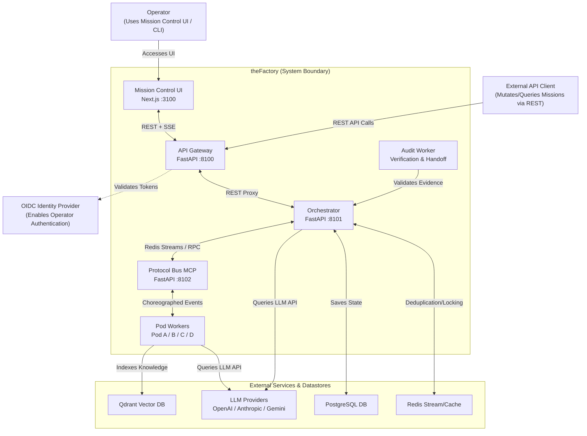
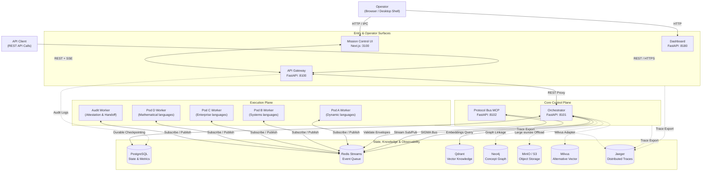
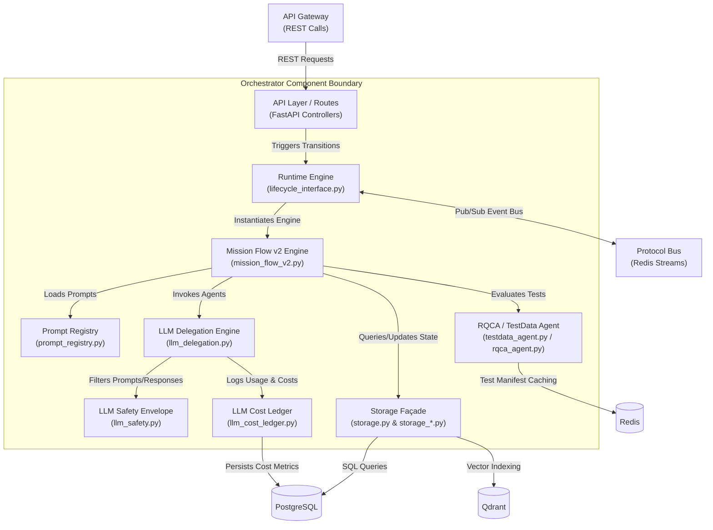
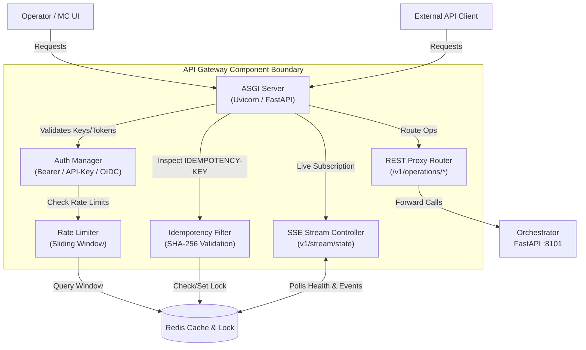
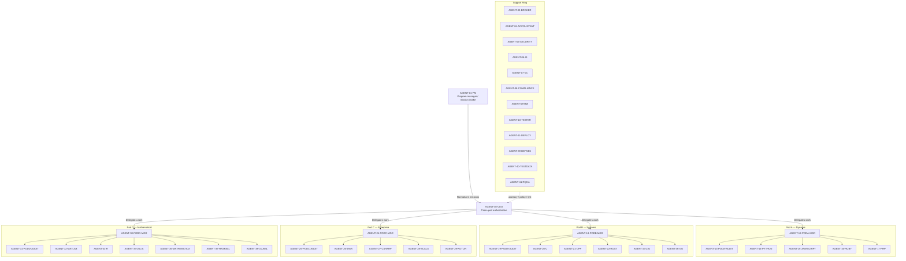
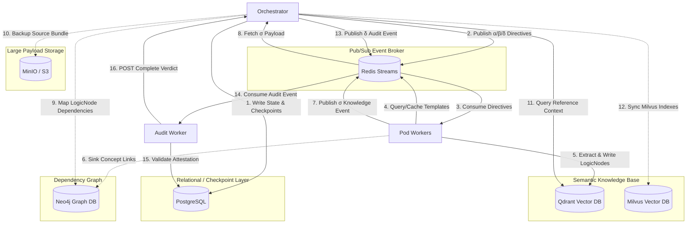
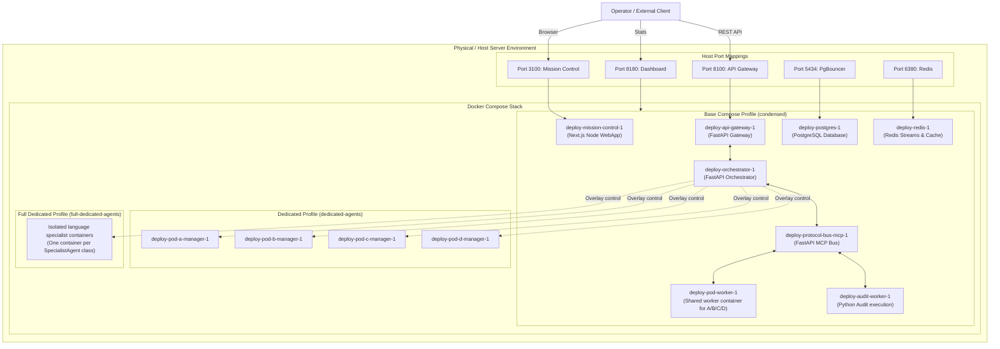

# Microsoft Enterprise Architecture Documentation — theFactory / HGR

**Document version:** 2026.06.26
**Last updated:** 2026-06-26
**Status:** Approved / Canonical  
**Audience:** Enterprise Architects, Technical Stakeholders, Lead Engineers, and Auditors  
**Security Classification:** Restricted — Internal Use Only

---

## Executive Summary

**theFactory** (Holy Grail Refinery - HGR) is a distributed, multi-agent software manufacturing platform designed to ingest natural-language mission specifications and compile fully tested, compliant source code outputs.

This document serves as the canonical **Microsoft Enterprise Standard Architecture Documentation** for theFactory. It structures the system into logical viewpoints using a hybrid C4 Model (System Context, Container, Component) and specific enterprise concerns (Data Architecture, Dynamic Runtime Sequence, Agent Topology, Security Boundaries, and Physical Infrastructure).

---

## Table of Contents

1. [C4 Level 1: System Context View](#1-c4-level-1-system-context-view)
2. [C4 Level 2: Container Architecture View](#2-c4-level-2-container-architecture-view)
3. [C4 Level 3: Component View (Orchestrator)](#3-c4-level-3-component-view-orchestrator)
4. [C4 Level 3: Component View (API Gateway)](#4-c4-level-3-component-view-api-gateway)
5. [C4 Level 3: Component View (Protocol Bus MCP)](#5-c4-level-3-component-view-protocol-bus-mcp)
6. [Dynamic Runtime Sequence View](#6-dynamic-runtime-sequence-view)
7. [Multi-Agent Hierarchy & Cognitive Routing](#7-multi-agent-hierarchy-cognitive-routing)
8. [Information & Data Plane Architecture](#8-information-data-plane-architecture)
9. [Security, Encryption & Trust Boundaries](#9-security-encryption-trust-boundaries)
10. [Deployment & Infrastructure Topology](#10-deployment-infrastructure-topology)

---

## 1. C4 Level 1: System Context View

### Viewpoint Description
Defines the high-level boundary of theFactory platform, mapping the external actors (Operators, API Clients, Identity Providers) and external backend services (LLM APIs, Datastores).



### Components
- **Operator**: Interacts with the platform via Next.js web application or Electron desktop client.
- **External API Client**: Performs automated mission creation and queries status programmatically.
- **LLM Providers**: Generative AI backends used to evaluate, reason, and write code.

*Standalone Source File: [01_system_context.mermaid](01_system_context.mermaid)*

---

## 2. C4 Level 2: Container Architecture View

### Viewpoint Description
Details the internal container and microservices organization of theFactory. Outlines host port maps, communication protocols, and all seven database storage nodes.



### Communications & Storage Matrix
- **REST APIs**: Used for Control Plane configuration and intake operations.
- **Redis Streams**: The primary protocol bus connecting execution workers with the orchestrator.
- **Distributed Databases**: PostgreSQL holds mission relational states; Qdrant holds vectorized knowledge; Neo4j stores abstract syntax tree (AST) dependency concept maps.

*Standalone Source File: [02_container_architecture.mermaid](02_container_architecture.mermaid)*

---

## 3. C4 Level 3: Component View (Orchestrator)

### Viewpoint Description
A component breakdown of the central `orchestrator` service, highlighting the StateGraph runtime, delegation helpers, safety envelopes, and the storage facade.



*Standalone Source File: [03_component_orchestrator.mermaid](03_component_orchestrator.mermaid)*

---

## 4. C4 Level 3: Component View (API Gateway)

### Viewpoint Description
Decomposes the public gateway, mapping the OAuth/OIDC/API-Key authenticator, sliding window rate limiter, and real-time Server-Sent Events (SSE) state streaming controller.



*Standalone Source File: [04_component_api_gateway.mermaid](04_component_api_gateway.mermaid)*

---

## 5. C4 Level 3: Component View (Protocol Bus MCP)

### Viewpoint Description
Highlights the routing rules, schema verification logic, and backpressure/replay mitigation components within the Protocol Bus microservice.

```mermaid
flowchart TB
    Orch["Orchestrator"]
    Workers["Pod Workers"]

    subgraph Bus["Protocol Bus MCP Component Boundary"]
        Entry["ASGI Server\n(FastAPI :8102)"]
        Router["6-Protocol Router\n(α, β, δ, σ, ω, ρ)"]
        Validator["Schema Validator\n(jsonschema.validate)"]
        Dedup["Replay & Dedup Filter\n(Correlation-ID Check)"]
        Backpressure["Backpressure Controller\n(Fail-Closed Check)"]
    end

    RedisStreams[(Redis Streams\nalpha | beta | delta | sigma | omega | rho)]
    RedisDedup[(Redis Cache\nduplicates | locks)]

    Orch & Workers -->|Publish Events| Entry
    Entry -->|Check Correlation-ID| Dedup
    Dedup -->|Lookup Key| RedisDedup
    Dedup -->|Check Load| Backpressure
    Backpressure -->|Query Stream Lengths| RedisStreams
    Entry -->|Validate Envelope Schema| Validator
    Validator -->|Parse Event Protocol| Router
    Router -->|Push to Stream| RedisStreams
```

*Standalone Source File: [05_component_protocol_bus.mermaid](05_component_protocol_bus.mermaid)*

---

## 6. Dynamic Runtime Sequence View

### Viewpoint Description
Illustrates the transaction and message flow from initial natural-language mission submission through agent extraction, verification gating, code generation, and delivery.

```mermaid
sequenceDiagram
    autonumber
    actor Operator
    participant MC as Mission Control UI
    participant GW as API Gateway (:8100)
    participant Orch as Orchestrator (:8101)
    participant Bus as Protocol Bus (:8102)
    participant Workers as Pod Workers
    participant Audit as Audit Worker
    participant Postgres as PostgreSQL DB

    Operator->>MC: Trigger new mission
    MC->>GW: POST /v1/missions (idempotent request)
    GW->>Orch: create_mission()
    Orch->>Postgres: Insert mission state (PM_INTAKE)
    Orch-->>GW: mission_id
    GW-->>MC: mission created

    rect rgb(20, 20, 30)
        note right of Orch: Smelt Cycle Begins (MissionFlow v2)
        Orch->>Bus: Publish Alpha Directive (α)
        Bus->>Workers: Dispatch Intake task
        Workers->>Orch: Return PM Charter (PM_INTAKE -> QUEUED)
    end

    rect rgb(25, 25, 40)
        note right of Orch: Core Execution (SMELT & FUSION)
        Orch->>Bus: Publish Beta Directive (β)
        Bus->>Workers: Dispatch extraction tasks
        Workers->>Workers: Extract LogicNodes (AST + Regex)
        Workers->>Orch: Return LogicNodes (Sigma Knowledge σ)
        Orch->>Postgres: Upsert LogicNodes
        Orch->>Orch: Merge to master logic stream
    end

    rect rgb(30, 20, 20)
        note right of Orch: Gating, Verification, Delivery
        Orch->>Bus: Publish Delta Directive (δ)
        Bus->>Audit: Dispatch verification task
        Audit->>Orch: GET /internal/review-approvals
        Orch-->>Audit: return review data
        Audit->>Audit: Verify signatures & equivalence
        Audit->>Orch: POST verification_report (VERIFIED)
        Orch->>Orch: Package build artifact with ECDSA signature
        Orch->>Postgres: Mark mission state (COMPLETE)
        Orch->>MC: SSE event state transition (COMPLETE)
    end
    
    Operator->>MC: View generated code & cost summary
```



*Standalone Source File: [06_mission_intake_lifecycle_sequence.mermaid](06_mission_intake_lifecycle_sequence.mermaid)*

---

## 7. Multi-Agent Hierarchy & Cognitive Routing

### Viewpoint Description
Details the command structure, support agents, specialist language worker pods, and system slot agents (AGENT-01 through AGENT-41) that collaborate to smelt the code.



*Standalone Source File: [07_agent_hierarchy_delegation.mermaid](07_agent_hierarchy_delegation.mermaid)*

---

## 8. Information & Data Plane Architecture

### Viewpoint Description
Details database queries, caching layers, and vector synchronization pipelines, demonstrating how relational structures, knowledge graphs, and S3-offloaded storage backends interact.



*Standalone Source File: [08_data_information_flow.mermaid](08_data_information_flow.mermaid)*

---

## 9. Security, Encryption & Trust Boundaries

### Viewpoint Description
Highlights the encryption zones, Mutual TLS links, DPAPI-protected private signing key store (A2 compliance), and output sanitation filters.

```mermaid
flowchart TB
    Operator["Operator\n(Browser)"]
    APIClient["API Client"]

    subgraph TrustZone_Public["Public untrusted boundary (HTTP/HTTPS)"]
        MC["Mission Control Server"]
        GW["API Gateway"]
    end

    subgraph TrustZone_Internal["Internal secure boundary (Mutual TLS / Service Token)"]
        Orch["Orchestrator\n(FastAPI)"]
        Bus["Protocol Bus\n(MCP :8102)"]
        Workers["Pod Workers\n(Python/JS/Java/Mathematical)"]
        Audit["Audit Worker"]
    end

    subgraph StateStore["Protected Datastores"]
        Postgres[(PostgreSQL\nTLS Encrypted)]
        Redis[(Redis\nTLS Encrypted)]
    end

    subgraph HostKeystore["Host Security Layer"]
        DPAPI["Windows DPAPI\n(Keystore A2)"]
        PEM["PEM Secrets fallback\n(Docker secret mount)"]
    end

    Operator -->|1. Signed operator session cookie| MC
    APIClient -->|2. x-api-key or OIDC JWT| GW
    MC -->|3. INTERNAL_SERVICE_API_KEY| GW
    GW -->|4. Forward auth request| Orch
    Orch -->|5. Query active sessions (TLS)| Redis
    Orch -->|6. Load credentials (TLS)| Postgres

    Orch -->|7. Access Protected Key| DPAPI
    Orch -->|7. Access Protected Key| PEM

    Orch <-->|8. Signed Events (TLS)| Bus
    Bus <-->|9. Signed Payload Event (TLS)| Workers
    Bus <-->|10. Evidence Verification (TLS)| Audit

    subgraph LLMSafety["LLM Safety Envelope"]
        Safety["llm_safety.py\n(Secret Sanitizer & Prompt Injection Block)"]
    end

    Orch & Workers -->|11. Filter outbound prompt| Safety
    Safety -->|12. Request codegen| LLM["LLM Provider APIs\n(HTTPS)"]
```

*Standalone Source File: [09_security_trust_boundaries.mermaid](09_security_trust_boundaries.mermaid)*

---

## 10. Deployment & Infrastructure Topology

### Viewpoint Description
Maps physical container deployment layouts, environment configuration profiles, and isolation options (Base condensed, dedicated, and full-dedicated specialist modes).



*Standalone Source File: [10_deployment_infrastructure.mermaid](10_deployment_infrastructure.mermaid)*
